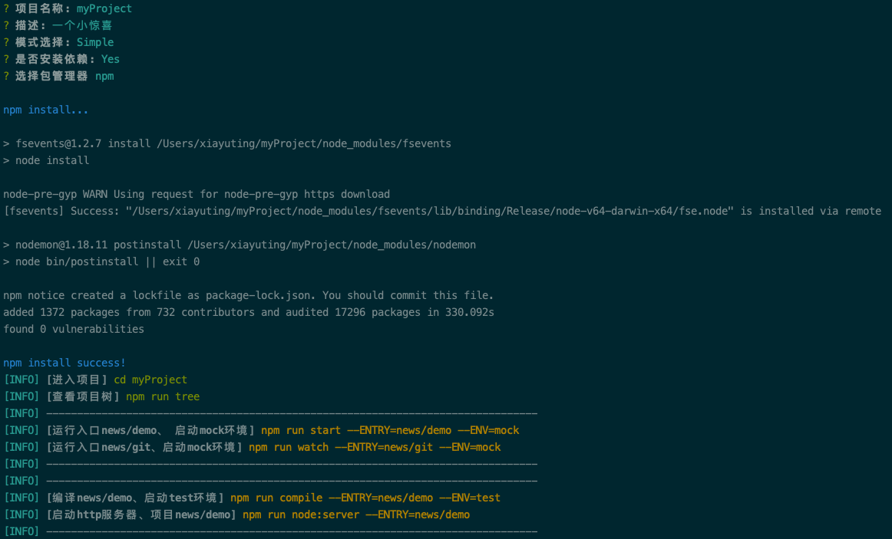

# @edwardxyt/gws-cli
Official React bindings for @edwardxyt/gws-cli, with mobx@5. react-router@5. webpack@4. antd
## Getting Started
### Installing globally:
Using npm:
```
npm -g install @edwardxyt/gws-cli --registry=https://registry.npm.taobao.org
```
Using yarn:
```
yarn global add @edwardxyt/gws-cli
```
### Usage:

```
gws-cli
```
执行后填写配置，回车执行生产一个脚手架文件夹。
> 注意：gws-cli已经放弃，请安装 @edwardxyt/gws-cli

## Example




```
xiayuting@xiayutingdeMacBook-Pro  ~  gws-cli
[gws-cli] version: 2.2.2
? 项目名称: website2020
? 描述:
? 模式选择: Base-2020(Alpha)
? 是否安装依赖: No
cp: no such file or directory: /Users/xiayuting/.nvm/versions/node/v10.14.2/lib/node_modules/@edwardxyt/gws-cli/src/base-2020(alpha)/
cd: no such file or directory: /Users/xiayuting/website2020
mv: no such file or directory: /Users/xiayuting/website2020/gitignore

[gws-cli] [未安装依赖请手动执行]
[gws-cli] [进入项目] cd website2020
[gws-cli] [安装依赖] npm run install
[gws-cli] [查看项目树] npm run tree --DIR=All
[INFO] --------------------------------------------------------------------------------
[gws-cli] [运行入口news/demo、 启动mock环境] npm run start --ENTRY=news/demo --ENV=mock
[INFO] --------------------------------------------------------------------------------
[INFO] --------------------------------------------------------------------------------
[gws-cli] [编译news/demo、启动test环境] npm run compile --ENTRY=news/demo --ENV=test
[gws-cli] [启动http服务器、项目news/demo] npm run node:server --ENTRY=news/demo
[INFO] --------------------------------------------------------------------------------
 xiayuting@xiayutingdeMacBook-Pro  ~ 
```
请选择Base-2020(Alpha)模式，这是最新版react脚手架，使用技术如下

| 模块名称 | 版本 |
| --- | --- |
| Webpack | 4 |
| Babel | 7 |
| react | 16.8 |
| antd | 3 |
| antd-mobile | 2 |
| mobx | 5 |
| react-router-dom | 5 |

### Detail
cd website2020(该名称为默认)，目录结构如下：
```
.
├── Dockerfile
├── README.md
├── bin
│   ├── compile.js
│   ├── del.js
│   ├── koa.server.js
│   ├── oss.js
│   ├── tag.js
│   └── tree.js
├── config
│   ├── console.js
│   ├── index.js
│   ├── project.js
│   ├── webpack.development.config.js
│   └── webpack.production.config.js
├── gitignore
├── jenkins
│   ├── README.md
│   └── release.server.docker.groovy
├── jest.config.js
├── package.json
├── postcss.config.js
└── src
    └── news
        └── demo
```

### Config & Use
上面目录目录结构中，/config/project.js，是您的项目启动配置文件。里面已有案例news/git 项目。如下：

```
news: {
        // 对应 __PROJECT__ 例：news/demo
        demo: {
            env: {
                // mock 对应 __ENV__
                mock: {
                    // 对应 __API__
                    api_path: "//127.0.0.1:3000",
                    // 对应 Vconsole
                    console: true,
                    // 对应 __CDN__ 修正路径作用
                    cdn_path: "./"
                },
                development: {
                    api_path: "//bizdev.aibao.com",
                    console: false,
                    cdn_path: "/devStatic/website2018/news/demo/"
                },
                test: {
                    api_path: "//bizapitest.aibao.com",
                    console: true,
                    cdn_path: "./"
                },
                ~~production~~: {
                    api_path: "//biz.aibao.com",
                    console: false,
                    cdn_path: "./"
                }
            }
        }
    }
```
> news/demo 就是 src目录下的目录结构。

```
npm run start --ENTRY=news/demo --ENV=mock
启动本地开发模式，项目名称为 news/demo 当前环境为mock 对上面的配置文件载入配置。
```

```
npm run compile --ENTRY=news/demo --ENV=production
启动静态编译模式，项目名称为 news/demo 当前环境为production 生成静态文件dist目录里。
```

```
npm run tree
tree:bin /Users/xiayuting/workBase/gws-cli2/src/news/demo/main.js +0ms
tree:bin 总数：1 +2ms
查看当前脚手架中，已有项目入口
```

```
npm run tree
npm run node:server --ENTRY=news/demo
启动本地http服务，静态目录为 dist/news/demo 所以 npm run compile 和 npm run node:server 的--ENTRY参数应该一样。
```
## License
MIT
