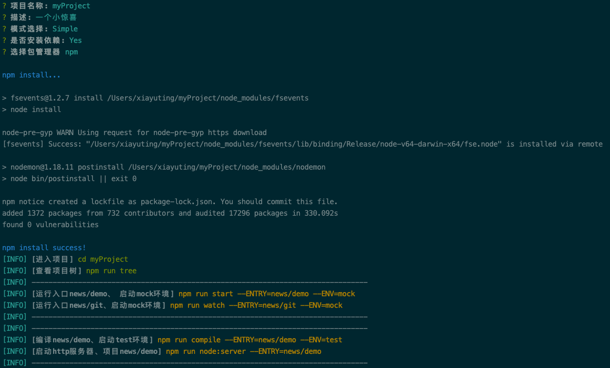

# @edwardxyt/gws-cli

    

(Generator website 发电的小风车。简称 gws-cli，)这是一个 web 脚手架工具，用于生成基于 webpack5,生成 typescript+react17+mobx5+reactRouter6 的应用。初衷是要解决多入口，多环境。单独编译单独运行的脚手架。做到小而美。拒绝锦上添花。

## Getting Started

| 模块名称         | 版本 |
| ---------------- | ---- |
| Webpack          | 5    |
| Babel            | 7    |
| react            | 17   |
| antd             | 4    |
| antd-mobile      | 2    |
| mobx-react       | 7    |
| react-router-dom | 6    |

### Installing globally:

Using npm:

```
npm -g install @edwardxyt/gws-cli
```

Using yarn:

```
yarn global add @edwardxyt/gws-cli
```

### Usage:

```
gws-cli
```

执行后填写配置，回车执行生产一个脚手架文件夹。

> 注意：gws-cli 已经放弃，请安装 @edwardxyt/gws-cli

## Example



```
xiayuting@xiayutingdeMacBook-Pro  ~  gws-cli
[gws-cli] version: 2.3.1
? 项目名称: website2020
? 描述:
? 模式选择: Base-2020(Alpha)
? 是否安装依赖: No
cp: no such file or directory: /Users/xiayuting/.nvm/versions/node/v10.14.2/lib/node_modules/@edwardxyt/gws-cli/src/base-2020(alpha)/
cd: no such file or directory: /Users/xiayuting/website2020
mv: no such file or directory: /Users/xiayuting/website2020/gitignore

[gws-cli] [未安装依赖请手动执行]
[gws-cli] [进入项目] cd website2020
[gws-cli] [安装依赖] npm run install
[gws-cli] [查看项目树] npm run tree --DIR=All
[INFO] --------------------------------------------------------------------------------
[gws-cli] [运行入口news/demo、 启动mock环境] npm run start --ENTRY=news/demo --ENV=mock
[INFO] --------------------------------------------------------------------------------
[INFO] --------------------------------------------------------------------------------
[gws-cli] [编译news/demo、启动test环境] npm run compile --ENTRY=news/demo --ENV=test
[gws-cli] [启动http服务器、项目news/demo] npm run node:server --ENTRY=news/demo
[INFO] --------------------------------------------------------------------------------
 xiayuting@xiayutingdeMacBook-Pro  ~ 
```

请选择 2022(Alpha)模式，这是最新版 react 脚手架，使用技术如下

### Config & Use

上面目录目录结构中，/config/project.js，是您的项目启动配置文件。里面已有案例 news/git 项目。如下：

```
module.exports = {
    activity: { // 多入口 “activity/christmas”
        christmas: {
            env: {  //多环境
                mock: {
                    api_path: "123123",
                    console: false,
                    cdn_path: "/"
                },
                development: {
                    api_path: "//:bizdev.aibao.com",
                    console: false,
                    cdn_path: "/"
                },
                test: {
                    api_path: "//:bizapitest.aibao.com",
                    console: false,
                    cdn_path: "/"
                },
                production: {
                    api_path: "//:biz.aibao.com",
                    console: false,
                    cdn_path: "/dist/activity/christmas/"
                }
            }
        }
    }
};
```

> activity/christmas/main.tsx 就是 src 目录下的目录下的一个入口文件。

```
npm run start --entry=activity/christmas --env=mock
启动本地webpack-dev-server服务，项目名称为 ctivity/christmas 当前环境为mock 对上面的配置文件载入配置。
```

```
npm run watch --ENTRY=activity/christmas --ENV=production
启动监听文件编译，项目名称为 ctivity/christmas 当前环境为production 生成静态文件dist目录里。
```

```
npm run compile --ENTRY=activity/christmas --ENV=production
启动静态编译模式，项目名称为 news/demo 当前环境为production 生成静态文件dist目录里。
```

```
npm run tree
tree:bin /Users/xiayuting/workBase/gws-cli2/src/news/demo/main.js +0ms
tree:bin 总数：1 +2ms
查看当前脚手架中，已有项目入口
```

### Use husky 7

首先关联好 git 仓库

```
cd website2022
git init
git remote add origin ssh://git@gitlab.xiayuting.cc:2222/root/website2022.git
git add .
git commit -m "Initial commit"
git push -u origin master
```

生成规则

```
Edit package.json > prepare script and run it once:
npm set-script prepare "husky install"
npm run prepare
```

```
npx husky add .husky/pre-commit "npx lint-staged"
git add .husky/pre-commit
```

```
Make a commit:
git commit -m "Keep calm and commit"
# `npx lint-staged` will run
```

---

## version3，的设计思路仍然没有变化，主要是全面升级 webpack 和 react 全家桶。加入 typeScript。

## 走着

- [设计初衷](#设计初衷)
- [一个套住你的框框](#一个套住你的框框)
- [升级遇到的坑](#升级遇到的坑)

### 设计初衷

**最新版是 2022 年 1 月开发的，对应选项“2022(Alpha)”。**

**杠宝**：首先主流的 cli 工具不论细节和维护，都要比你的小而美强百倍，为什么你还要写一个这种简单的脚手架呢？

**卡片**：create-react-app 确实是顶级优秀的工具，但是，我想要个精简，并且包含固定的 react 全家桶（react+router+mobx+antd）。并且他可以适合大家随时可以扩展功能，<u>npm-check -u</u>。最主要的一点。就是我要多入口。

**杠宝**：你说什么多入口啊？webpack.entry？那你可以多传几个入口文件，这么简单也叫多入口？

**卡片**：对对对对。其实我的 **“初衷”** 是为了杜绝两件事，

**卡片**：1，公司内部新起一个项目时，我并不想 copy 一个老项目删除 src，或者 cli 生成一个空的脚手架后，我还需要各种安装 package。

**卡片**：2，我希望不论我本地起环境，还是 build 输出。我只运行或 build 我已修改的那个入口。而不是你说的 webpack.entry。

**杠宝**：那你怎么实现的，难道你可以一个脚手架，里放多个项目嘛？

**卡片**：对对对对。确实我的脚手架可以做到，你在公司里的某一事业部。只用一个脚手架就包含有多个项目，多个端。并且可以单独编译，单独运行。互不影响。

**卡片**：实现是这样的 src 下是有两层目录的。src/activity/christmas。终端输入<u>npm riun start --entry=activity/christmas --env=mock</u>后，gws 就会通过 glob 找到指定目录下寻找 main.tsx 的入口文件，并根据 ENV 加载对应环境的配置。并运行。

**卡片**：这样，你只启动了 src/activity/christmas/main.tsx 这一个入口，而且环境是随便定义的。您只需要启动时或编译时，带参数即可。简单吧。实用吧。

**卡片**：而且两层目录，给你足够的命名区分业务空间。足够你规划项目分类啦

**卡片**：小而美的定义，就是通过没用的减法，小小设计大大优化。拒绝一切没用的花花

### 一个套住你的框框

> 百度百科：约定大于配置，也可以叫做约定优于配置（convention over
> configuration），也称作按约定编程，是一种软件设计范式，指在减少软件开发人员需做决定的数量，获得简单的好处，而又不失灵活性。

使用 react，我喜欢的是组件化编程思想，他不再像以前，我们把所有类型文件都放在一个目录下，而现在我可以一个文件夹下，多个不同种类的文件在一起。这个文件夹就是一个组件。当我不需要这个组件时候，直接 del。不需要考虑是否少删，是否多删。让大型共建项目，可持续维护。减少冗余。

**所以，gws 集成了以下配置，**

1. 入口的 html 是一个 ejs 文件，为什么要模版引擎呢？因为在启动或编译时，我注入了运行是环境信息，不但使用 webpack.DefinePlugin 注入，还注入到了 ejs 里。这样在此可以将一写配置渲染到 index.html 中。可以写判断加载非 esModule（既\<script src=" "/>）等情况。
2. 以前我们开发活动页面时，需要做移动端和 pc 端，除了大小不同，元素基本相同。通常是根据域名h**p://m.xxx访问，并在nginx判断转发。现在我们通过ua来判断加载哪个入口组件解决。不需要二级域名，不需要nginx判断
3. main.tsx 除了判断入口组件，还可写 pwa、qiankun、并且是使用 webpack 按需加载的，
4. 所有的多入口多环境，统一在配置文件里配置，不需要写在项目中。
5. gws 使用 react17 框架 mobx-react7 数据框架 react-router-dom6 路由 antd4 antd-mobile2 等。基本上属于最新版。

那什么是约定大于配置呢，脚手架目录 src/activity/christmas 类似这样的。入口之后的文件安排。全凭开发者自己归纳设计。gws 含有 eslint，含有 typescript 等，如何使用全凭开发者选择。我自己也不喜欢大家风格一样。这样就没有创新空间了。所以这里叫做一个套住你的框框。

## 我遇到的坑

### webpack5

- eslint-loader 作废，改为 eslint-webpack-plugin
- file-loader 和 url-loader 作废，webpack 内置集成
- 本地启用 devserver 命令更改，webpack-dev-server 改为 webpack serve
- 不支持 babel-polyfill，改用@babel/runtime-corejs3 和@babel/plugin-transform-runtime
- mini-css-extract-plugin 提取到.css 文件里，生产环境替换 style-loader。
- optimize-css-assets-webpack-plugin 作废替换为 css-minimizer-webpack-plugin
- clean-webpack-plugin 过期，改用 bin/del 替代
- friendly-errors-webpack-plugin 断崖改用@soda/friendly-errors-webpack-plugin
- eslint-webpack-plugin 替换 es-loader 目前还没有生效
- mobx-react-devtools 过时 已经删除
- 加入端口检查（原来有）
- 加入 gzip
- 加入 pwa
- 加入 qiankun
- 加入 BundleAnalyzerPlugin（原来有）
- handlebars 换成 ejs
- less postcss（原来有）

### babel7

- 只安装 >=2021 以上的插件。2018、2019、2020 都已经集成在 env 里

### eslint
- husky升级到7，初始化时，需要项目先关联git init，然后执行husky初始化命令。
- eslint 监控 .jsx,.js,.ts,.tsx 
- stylelint 监控 css,less,scss
- prettier 修复js,jsx,ts,tsx,css,md,json
- cz-conventional（commitlint）工具 提供Commit message 和 Change log验证
- lint-staged
    - 比如代码的走了eslint和prettier，先规范，后格式化
    - 比如样式的只走格式化
    - 比如其他prettier支持的必要文件也走一下格式化

### jest react
- 待配置

### typeScript

- 文件路径问题 include: [ "./typings/**/*" ]
- typeScript-loader 不可以用 babel 插件代替 要配合使用.

### react-router6

- 官方已经放弃 class 组件，全部都是 hook 组件，老应用无法升级
- 只支持 Navigate useNavigate 建议用 store 控制登陆
- history 无效 需要实现两种跳转。包括无状态组件和类组件（hoc 可以解决）

## License

MIT
